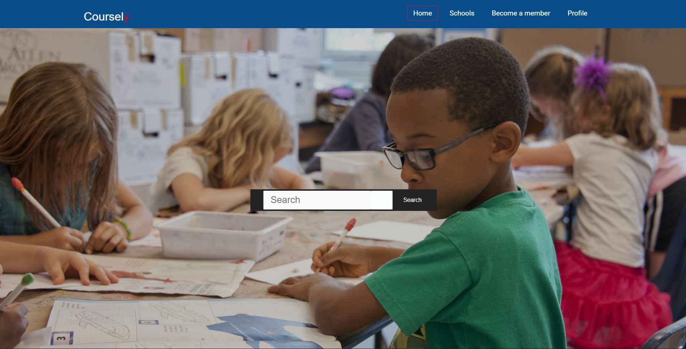
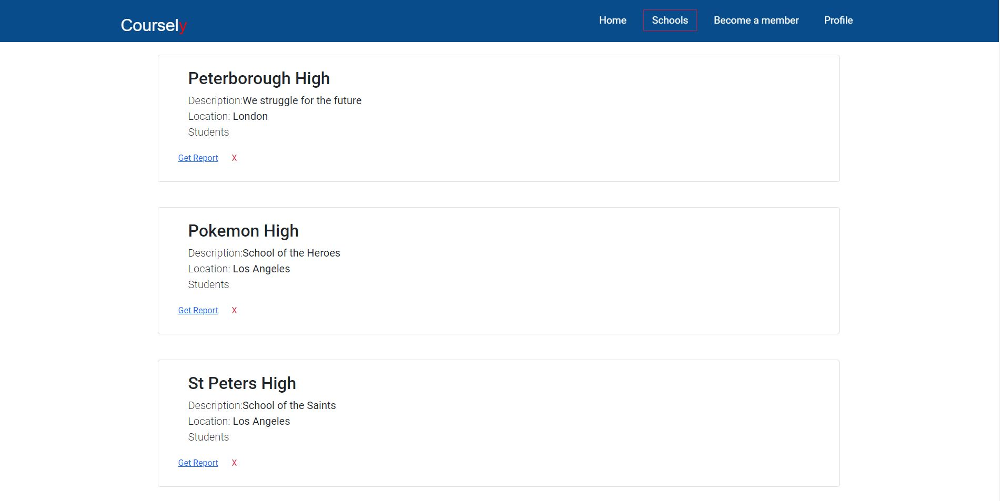
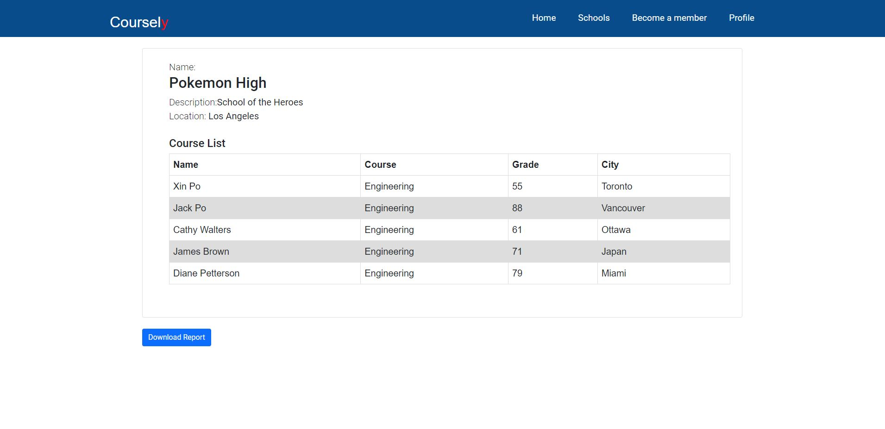
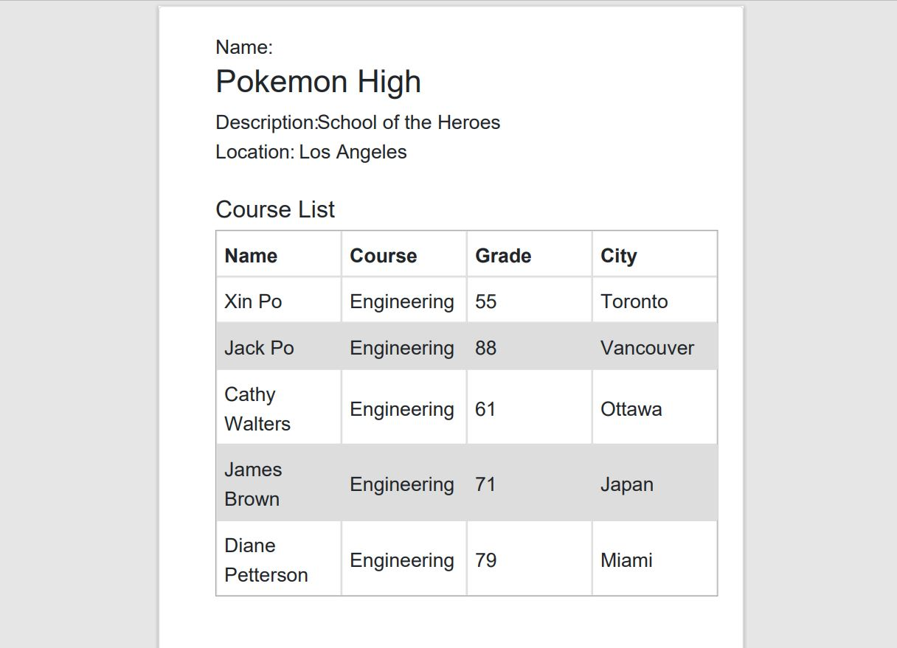

# Coursely

<p align="center"> 

</p>

<p align="center">
 <a href=""></a>
 <a href=""></a>
 <a href=""></a>
 <a href=""></a>
</p>

## Table of Contents

-  [Description](#description)
   -  [User Story](#user-story)
-  [Technologies](#technologies)
-  [Usage](#usage)
   -  [Deployment and Demo](#deployment-and-demo)
   -  [Screenshots](#screenshots)
   -  [Tips](#tips)
-  [Developer](#Developer)
-  [Contributing](#contributing)
-  [License](#license)

## Description

You are enrolled in a school and want to be checking in on your reports and results for the school and class that you are in, you want to have a functionality to be able to download the report and also set up an account that will give access to your school reports in the future so that you don't have to be collecting papers or even keeping track of your emails 

Coursely is an online application that helps students to have a connection and access with their school by accessing reports on a yearly basis and also have access to course materials to enable students keep track of what areas they would like to succeed in. Teachers are able to post and update reports basing on the academic term and also through online tests attempted by students

### User Story:

```
User Story
As a student
I want to be able to access my reports for my school
So that I can stay on top of my performance
```

## Technologies

-  [Bootstrap](https://getbootstrap.com/)/[CSS3](https://www.w3schools.com/css/default.asp)/[HTML5](https://www.w3schools.com/html/)
-  [React]
-  [MongoDB]
-  [Mongoose]
-  [Postman]
-  [JQuery]
-  [Git](https://git-scm.com/)/[GitHub](https://github.com/features)
-  [Node.js]
-  [Express.js]
-  [Heroku]

## Usage

A first time user opens the application and searches or accesses drop down menu to access their school

1. The schools or school given on search appear and the user opens by clicking get report button

2. The user is able to access report and downloads it in their browser

### Deployment and Demo

Heroku was used for app deployment.


### Screenshots

<p align= "center">

</p>

### Click on the arrows to drop down more images of the app.

<details>
  <summary>Home Page with search school Functionality and navigation</summary>
  

</details>
<details>
  <summary>All schools</summary>
  
</details>
<details>
  <summary>School By Id</summary>
  
</details>
<details>
  <summary>Downloaded Document to PDF </summary>
  
</details>

### Tips

1. You are able to clone this repo or download a zip file to your local machine.
2. If you have cloned a repo and a package.json exists, you are able to see the dependencies and dev dependencies used in the application. If this is the case run the below command to get all the dependencies need for that application.

```
$ npm i
```

3. In order to run application after cloning the repo run 

```
npm run dev
```
## Developer

-  Farouk Kisuule- [https://github.com/Farouk994](https://github.com/Farouk994)

## Contributing

Steps to contribute:

1. Fork the repo on GitHub.
2. Clone the project to your own machine.
3. Commit changes to your own branch.
4. Push your work back up to your fork/branch.
5. Submit a Pull Request so that we can review your changes.

## License

[MIT Copyright © 2021]
